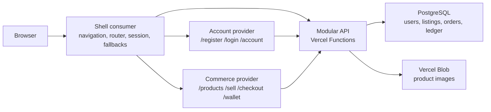

# Enterprise microfrontend plan for the marketplace MVP

Status: proposed  
Date: 4 September 2026  
Audience: founding frontend engineer  
Decision horizon: MVP first, scalable boundaries without premature services

## 1. Executive decision

Build an Nx integrated monorepo with:

- `shell`: the Module Federation consumer and application frame.
- `account`: a provider for registration, login, logout, and account screens.
- `commerce`: a provider for product browsing, selling, checkout, orders, and the simulated wallet.
- `api`: one modular-monolith backend, deployed with the shell as Vercel Functions.
- PostgreSQL for transactional data and Vercel Blob for product images.

Start with exactly two providers. A provider is a business ownership boundary, not a screen. Do not make `register`, `login`, `sell`, or `wallet` separate microfrontends.

Use Nx 23.2's current `consumer`/`provider` model with Vite and the official Module Federation plugins. Nx v23 deprecated the older `host`/`remote` generator surface, and Vite is now the default choice for fastest development and the smallest configuration surface. [Nx consumer/provider guide](https://nx.dev/docs/kb/consumer-and-provider), [Nx Module Federation introduction](https://nx.dev/docs/technologies/module-federation/introduction)

This topology is intentionally conservative. Microfrontends add network failures, runtime compatibility, deployment skew, cross-app observability, and contract testing. Two providers expose all of those enterprise concerns while keeping a solo-engineer MVP understandable.

## 2. Product scope

### MVP use cases

1. Register with email and password.
2. Log in and log out.
3. Browse active products and view a product.
4. Create a draft listing, upload images, publish it, and mark it unavailable.
5. Receive a seeded virtual balance for testing.
6. Buy an available product with that balance.
7. Debit the buyer, credit the seller, create an order, and mark the product sold atomically.
8. View orders and wallet transaction history.

### Explicitly out of scope

- Real money, payment gateways, withdrawals, refunds, tax, escrow, KYC, or chargebacks.
- Shipping, chat, offers, favorites, recommendations, search infrastructure, and native apps.
- Multiple currencies in one transaction. Store a currency on every monetary record, but launch with EUR only.
- Backend microservices, Kafka, Kubernetes, GraphQL federation, or a global client-side event bus.

Call the feature a **simulated wallet**, not a payment gateway. It is a learning implementation and must never imply that real funds are held.

## 3. Target architecture



### Ownership rules

| Unit | Owns | Must not own |
|---|---|---|
| Shell | HTML document, app frame, top-level router, session bootstrap, feature flags, global error handling, remote registry, telemetry bootstrap | Product or wallet business logic |
| Account provider | Registration/login/account journeys and account-specific validation | Session secrets, authorization decisions, product code |
| Commerce provider | Listings, selling, checkout, order history, wallet history | Authentication implementation or authoritative balances |
| API | Authentication, authorization, validation, transactions, persistence, audit events | UI composition |
| Shared libraries | Design tokens/components, generated API types/client, telemetry interface, pure utilities, test helpers | Domain workflows or mutable global state |

Providers never import from each other. They communicate through URLs and the backend. This prevents a monorepo from becoming a distributed monolith.

### Route composition

The shell owns the only browser router and lazily mounts provider roots:

| Route | Owner |
|---|---|
| `/`, `/products/:id` | Commerce |
| `/sell`, `/my-listings` | Commerce |
| `/checkout/:productId`, `/orders`, `/wallet` | Commerce |
| `/register`, `/login`, `/account` | Account |
| `/error`, `/maintenance`, not-found | Shell |

Each provider exposes one stable public module, `./App`, which handles relative routes below its mount point. It must also run standalone with mock adapters so its team can develop and test without the full composition.

### Runtime federation contract

- Register providers at startup from an environment-specific `remotes.json`; do not compile production URLs into source code.
- Mandatory singleton dependencies: `react`, `react-dom`, and `react-router-dom` with exact compatible ranges.
- Do not share every dependency. Bundle domain libraries into their provider. Share only packages whose identity/context must be common or whose measured size justifies coupling.
- Generate and consume remote TypeScript declarations, but also keep a small source-controlled `platform-contracts` package for the stable shell/provider interface. Module Federation supports generated remote types by default. [Module Federation type hinting](https://module-federation.io/guide/basic/type-prompt)
- Wrap each provider in `Suspense` plus an error boundary with timeout, retry, support ID, and a useful fallback route.
- Log `{shellVersion, providerName, providerVersion, gitSha, remoteUrl}` on load and error.
- Use a `loaded-first` sharing strategy only after a performance test; version-first can eagerly contact providers during startup and makes an offline provider part of initial load. [Module Federation share strategies](https://module-federation.io/configure/shareStrategy.html)
- Treat exposed modules as public APIs: additive changes first, deprecation window, N and N-1 compatibility, and no unannounced breaking changes.

## 4. Technology baseline

Use stable releases and pin them through the root `packageManager`, lockfile, and dependency catalog. On the research date the relevant baselines are Nx 23.2, React 19.2, TypeScript 6.0, Vite 8.x, and Node 24 LTS. [Nx changelog](https://nx.dev/changelog), [React versions](https://react.dev/versions), [TypeScript 6.0](https://www.typescriptlang.org/docs/handbook/release-notes/typescript-6-0.html), [Vite releases](https://vite.dev/releases), [Node releases](https://nodejs.org/en/about/previous-releases)

| Concern | Choice | Reason |
|---|---|---|
| Workspace | Nx 23.2 integrated monorepo + pnpm workspaces | Project graph, affected tasks, cache, generators, and enforceable boundaries |
| UI | React 19.2 + TypeScript strict | Stable, current React supported by Nx; strict typing is non-negotiable |
| Federation/build | Nx consumer/provider + `@module-federation/vite` + Vite 8 | Current Nx path; small configuration and fast iteration |
| Routing | React Router, owned by shell | One history and navigation model across providers |
| Server data | TanStack Query inside provider data-access libraries | Cache/retry/invalidation without a global business store |
| Forms/validation | React Hook Form + Zod | Typed forms; share schemas only when they are true wire contracts |
| Styling | CSS variables/tokens + CSS Modules; Storybook for shared UI | Isolation, portability, and visible design-system contracts |
| API | Hono modular monolith on Vercel Functions | Small Web-standards surface; Hono is among Vercel's supported backend frameworks. [Vercel backend frameworks](https://vercel.com/docs/frameworks/backend) |
| API contract | OpenAPI 3.1.x initially + generated client | Use 3.2 only after the selected generator validates and generates it end to end; 3.2 is the current specification. [OpenAPI versions](https://spec.openapis.org/oas/) |
| Persistence | PostgreSQL + Drizzle migrations | ACID transactions, constraints, transparent SQL, and type-safe access |
| Media | Vercel Blob client upload | Direct upload avoids the 4.5 MB Function request limit. [Vercel Blob client upload](https://vercel.com/docs/vercel-blob/client-upload) |
| Unit/component tests | Vitest + React Testing Library + MSW | Fast behavior tests at public boundaries |
| End-to-end | Playwright | Cross-browser and mobile project support. [Playwright projects](https://playwright.dev/docs/test-projects) |
| Observability | Structured server logs + trace/request ID + browser error/RUM SDK | End-to-end diagnosis; browser OpenTelemetry remains experimental. [OpenTelemetry JS status](https://opentelemetry.io/docs/languages/js/) |

Avoid adopting a technology because it is new. Add it only when it has a named problem, an owner, a rollback path, and a measurable success criterion.

## 5. Repository design

```text
vinted-app/
├── apps/
│   ├── shell/                    # MF consumer, app frame, runtime registry
│   ├── account/                  # MF provider
│   ├── commerce/                 # MF provider
│   └── api-dev/                  # local adapter for the modular API
├── api/
│   └── [...route].ts             # thin Vercel Function adapter
├── libs/
│   ├── account/
│   │   ├── feature-auth/
│   │   ├── data-access/
│   │   └── ui/
│   ├── commerce/
│   │   ├── feature-catalog/
│   │   ├── feature-selling/
│   │   ├── feature-checkout/
│   │   ├── data-access/
│   │   └── ui/
│   ├── backend/
│   │   ├── auth/
│   │   ├── catalog/
│   │   ├── orders/
│   │   ├── wallet/
│   │   └── database/
│   └── shared/
│       ├── ui/
│       ├── contracts/
│       ├── api-client/
│       ├── observability/
│       ├── config/
│       └── test-utils/
├── tools/
│   ├── generators/
│   └── scripts/
├── docs/
│   ├── adr/
│   ├── runbooks/
│   └── enterprise-microfrontend-plan.md
├── .github/workflows/
├── nx.json
├── pnpm-workspace.yaml
└── package.json
```

Keep apps thin and put cohesive code in domain/type libraries. Nx describes `feature`, `ui`, `data-access`, and `util` as a scalable vocabulary and recommends public APIs for libraries. [Nx folder structure guidance](https://nx.dev/docs/kb/folder-structure)

### Executable boundaries

Tag every project on two axes:

- Scope: `scope:shell`, `scope:account`, `scope:commerce`, `scope:backend`, `scope:shared`.
- Type: `type:app`, `type:feature`, `type:data-access`, `type:ui`, `type:util`, `type:contract`.

Enforce these rules with `@nx/enforce-module-boundaries` in CI:

1. Domain code may depend on its own scope and `scope:shared` only.
2. `shared` cannot depend on a business domain.
3. `ui` can depend only on `ui`, `util`, and contracts; never data-access.
4. `data-access` can depend on contracts/util, never features.
5. Frontend projects cannot import backend implementation libraries.
6. Providers cannot import each other.
7. Imports use library public entry points; no deep imports.

Nx supports tag-based constraints and fails lint on violations. [Nx module-boundary documentation](https://nx.dev/docs/features/enforce-module-boundaries)

## 6. Backend and data plan

Use one modular API and one database. Microfrontends do not require microservices. Split a backend service only when there is an independent scaling, security, data ownership, or team-deployment need.

### Initial tables

| Table | Key fields/invariants |
|---|---|
| `users` | UUID, normalized email unique, password hash, status, timestamps |
| `sessions` | hashed opaque token, user ID, expiry, revoked timestamp, metadata |
| `products` | seller ID, title, description, `price_minor`, `currency`, status, optimistic version |
| `product_images` | product ID, blob URL/key, order, media metadata |
| `orders` | product ID unique, buyer/seller IDs, captured price/currency, status |
| `wallet_accounts` | user ID + currency unique |
| `ledger_transactions` | type, reference, unique idempotency key, timestamp |
| `ledger_entries` | transaction ID, account ID, debit/credit direction, positive `amount_minor` |
| `audit_events` | actor, action, entity, request ID, timestamp, safe metadata |

Store money as integer minor units (`BIGINT`) plus ISO currency, never JavaScript floating point. PostgreSQL also recommends exact `numeric` for monetary quantities and supports database constraints for positive values, uniqueness, and referential integrity. [PostgreSQL numeric types](https://www.postgresql.org/docs/current/datatype-numeric.html), [PostgreSQL constraints](https://www.postgresql.org/docs/current/ddl-constraints.html)

### Purchase transaction

One database transaction must:

1. Validate the authenticated buyer and idempotency key.
2. Lock the product and buyer wallet rows.
3. Assert product is active, seller is not buyer, currency matches, and balance is sufficient.
4. Create the order using the product's server-side price.
5. Mark the product sold with optimistic/version protection.
6. Append one ledger transaction with balanced buyer debit and seller credit entries.
7. Commit all changes together or roll all of them back.

Ledger entries are append-only. Corrections are new reversing transactions. A balance is derived from entries or maintained as a transactionally checked projection; never accept a balance or price calculated by the browser.

Every mutating endpoint accepts an idempotency key. Test double submission, two buyers racing for one product, insufficient funds, and retry after a network timeout.

## 7. Security baseline

- Hash passwords with Argon2id using at least the current OWASP minimum; never encrypt or log passwords. [OWASP password storage](https://cheatsheetseries.owasp.org/cheatsheets/Password_Storage_Cheat_Sheet.html)
- Use opaque server sessions in `__Host-` cookies with `Secure`, `HttpOnly`, `Path=/`, and an explicit `SameSite` policy. Do not store access or refresh tokens in local/session storage. [OWASP session management](https://cheatsheetseries.owasp.org/cheatsheets/Session_Management_Cheat_Sheet.html)
- Use a CSRF token for state-changing requests; SameSite is defense in depth, not a complete CSRF solution. [OWASP CSRF prevention](https://cheatsheetseries.owasp.org/cheatsheets/Cross-Site_Request_Forgery_Prevention_Cheat_Sheet.html)
- Perform object-level authorization on every endpoint receiving a product, order, wallet, or user ID. Random IDs do not replace authorization. [OWASP BOLA guidance](https://owasp.org/API-Security/editions/2023/en/0xa1-broken-object-level-authorization/)
- Add rate limits for register/login, password attempts, image-upload tokens, and purchase attempts.
- Validate request and response shapes on the server. Return safe errors; log details with a request ID.
- Use CSP, HSTS, `nosniff`, frame protection, a restrictive permissions policy, and an allowlist for remote script origins.
- Remote JavaScript is privileged code running in the shell's page. Only load HTTPS manifests from an allowlist controlled by configuration; never accept a remote URL from query parameters or user input.
- Keep secrets only in Vercel environment variables. Frontend-prefixed environment variables are public.
- Use a private database network/SSL, pooled serverless connection string, least-privilege database role, automated backups, and tested restore instructions. Vercel explicitly recommends pooling and placing Functions near the database. [Vercel storage guidance](https://vercel.com/docs/marketplace-storage)
- Scan uploads by allowlisted MIME/signature, size, and dimensions; randomize keys and strip unneeded metadata.

## 8. CI pipeline

Use GitHub Actions for validation and Vercel Git integration for preview/production deployments.

### Pull request pipeline

```text
checkout full history
  -> install with frozen lockfile
  -> format check
  -> nx affected: lint + typecheck + unit tests
  -> nx affected: build
  -> architecture-boundary check
  -> dependency review + secret scan + CodeQL
  -> database migration validation on disposable DB
  -> Vercel previews for shell/account/commerce
  -> federation manifest smoke test
  -> Playwright composed critical journeys
  -> required checks allow merge
```

Use `nx affected` with full Git history and Nx remote caching. Nx documents that `affected` removes unchanged work and remote caching avoids re-running matching work; add Nx Agents only after CI duration justifies distribution. [Nx CI setup](https://nx.dev/docs/getting-started/setup-ci), [Nx remote cache](https://nx.dev/docs/features/ci-features/remote-cache)

Do not use `@vercel/remote-nx` with modern Nx; Vercel documents that its custom task runner is incompatible with Nx 20+. Use Nx Cloud or an Nx-compatible self-hosted cache. [Vercel Nx deployment guide](https://vercel.com/docs/monorepos/nx)

Required checks on `main`:

- `quality`: format, lint, boundary rules, strict typecheck.
- `unit`: affected unit/component tests with coverage thresholds on changed code.
- `build`: all affected deployables and federation type generation.
- `security`: dependency review, secret scanning, CodeQL.
- `db`: migrations apply from empty and previous schema; rollback/forward-fix documented.
- `preview-e2e`: registration, login, create listing, purchase, ledger result, and remote-unavailable fallback.

GitHub can require status checks before merging, and dependency review can block newly introduced vulnerable packages. [GitHub status checks](https://docs.github.com/en/pull-requests/reference/status-checks), [GitHub dependency review](https://docs.github.com/en/code-security/concepts/supply-chain-security/dependency-review)

### Cache correctness

- Declare task inputs, environment inputs, and outputs precisely.
- Never cache deployments or DB migrations.
- Use read-only cache credentials for untrusted PRs and write credentials only on trusted branches.
- Include federation config, runtime contract package, lockfile, and relevant environment names in build inputs.

## 9. Vercel deployment design

Create three Vercel projects from the same Git repository:

| Vercel project | Artifact | Production role |
|---|---|---|
| `market-shell` | `apps/shell` static SPA plus root `/api` Functions | Default domain, same-origin API |
| `market-account` | `apps/account` static provider | Account remote assets |
| `market-commerce` | `apps/commerce` static provider | Commerce remote assets |

Vercel supports multiple projects pointing at one monorepo and automatically skips unchanged workspace projects when its dependency requirements are met. [Vercel monorepo documentation](https://vercel.com/docs/monorepos)

### Environment mapping

- Local: shell `5100`, account `5101`, commerce `5102`, API dev adapter `3333`; shell proxies `/api` to `3333`.
- Preview: Vercel Related Projects supply matching account and commerce preview hosts; generate `remotes.json` for that shell deployment.
- Production: use stable controlled provider domains/aliases. Store their URLs as environment configuration, not source constants.

Related Projects supports up to three links per app and is designed to expose matching preview/production hosts. It only supports Git-connected projects, so use Vercel Git integration for this workflow. [Vercel Related Projects](https://vercel.com/docs/monorepos#how-to-link-projects-together-in-a-monorepo)

### Release order and rollback

1. Build all changed providers and shell from one commit.
2. Run provider standalone tests.
3. Deploy immutable previews.
4. Generate the shell remote map pointing to those exact preview deployments.
5. Run composed smoke and critical Playwright tests.
6. Promote backward-compatible providers first, then the shell configuration.
7. Keep last-known-good remote URLs. Roll back by restoring the previous map/alias; use a remote kill switch when a provider is unhealthy.

Set `remoteEntry.js`/`mf-manifest.json` to revalidate or no-cache and content-hashed chunks to long-lived immutable caching. Never replace files under an existing immutable deployment URL.

Vercel's native Microfrontends product is a separate, path-routing capability. It is not required for Module Federation. Evaluate it later for same-domain path routing/local proxy behavior, after checking current project limits and pricing. [Vercel Microfrontends](https://vercel.com/docs/microfrontends)

## 10. Test strategy

### Test by risk, not by an arbitrary pyramid

| Level | Required coverage |
|---|---|
| Pure unit | Price formatting, validators, ledger rules, authorization policies, state reducers |
| Component | Forms, validation/errors, keyboard behavior, loading/empty/error states, provider fallback |
| API integration | Real PostgreSQL container/branch DB; auth, ownership, constraints, transactions, concurrency |
| Federation contract | Remote manifest exists, exposed module loads, generated types compile, required singletons match |
| Composed E2E | Register -> login -> sell -> browse -> buy -> verify buyer debit/seller credit |
| Resilience | Provider 404/timeout/bad version, API 500, duplicate submit, expired session, slow network |
| Non-functional | Accessibility, bundle budgets, Core Web Vitals, security headers, basic load test on purchase |

Run Chromium critical journeys on every PR. Run Firefox/WebKit and mobile viewports nightly and before release. Playwright supports browser/device-specific projects. [Playwright projects](https://playwright.dev/docs/test-projects)

Accessibility target: WCAG 2.2 AA, including keyboard-only flows, visible/unobscured focus, usable target sizes, labels, errors, and accessible authentication. [W3C WCAG 2.2](https://www.w3.org/TR/WCAG22/)

### Initial quality budgets

- No unhandled error in a critical E2E journey.
- 100% of API endpoints have authentication/authorization classification.
- 100% of money mutations have idempotency and integration tests.
- Initial shell JS target under 200 KB gzip, excluding lazy provider code; measure and adjust based on real data.
- Each route provider gets an explicit performance budget and reports its contribution.
- Zero critical/high newly introduced dependency vulnerabilities.
- Coverage is a safety indicator, not the goal; require high coverage for ledger/auth policies and meaningful changed-code coverage elsewhere.

## 11. Observability and operations

Every request and user-visible failure should be traceable across shell, provider, API, and database logs.

Capture:

- Frontend release, provider release, route, remote load duration/result, Web Vitals, error boundary events.
- API request ID, route template, status, latency, authenticated actor ID (not credentials), deployment SHA, database duration.
- Business events: registration completed, listing published, checkout started/succeeded/failed, idempotent replay, ledger invariant failure.
- Never log passwords, cookies, session tokens, CSRF tokens, raw authorization headers, or full personal data.

Create runbooks before production for remote unavailable, login outage, failed migration, incorrect wallet balance, image-upload abuse, rollback, and database restore. Define starter SLOs after collecting baseline traffic; do not invent meaningful latency/error targets without data.

## 12. Delivery roadmap

Treat durations as focused-engineering estimates, not promises. Each phase ends in a working, demonstrable system.

### Phase 0 — Decisions and fitness functions (1–2 days)

- Write ADRs for MFE purpose, provider boundaries, API style, auth/session model, wallet ledger, and deployment topology.
- Define scope tags/type tags and dependency rules before feature code.
- Record a dependency/version policy and supported browsers.

Exit: architecture decisions are reviewable, and a forbidden dependency can be demonstrated failing CI.

### Phase 1 — Workspace foundation (2–3 days)

- Scaffold Nx 23.2 with pnpm, Node 24 LTS, TypeScript strict, React, and Vite.
- Generate `shell` consumer plus `account` and `commerce` providers using Nx v23 generators.
- Add formatting/linting, Vitest, Playwright, Storybook, environment validation, and commit hooks.
- Add shared tokens/components, error boundary, loading UI, provider standalone harness, and runtime remote registry.

Exit: all three apps run independently and composed; stopping one provider shows a controlled fallback.

### Phase 2 — API and database foundation (3–4 days)

- Build the thin Vercel Function adapter and modular Hono API.
- Add PostgreSQL, migrations, test database, structured errors, request IDs, health/readiness endpoints.
- Publish an OpenAPI document and generate the frontend client.
- Configure pooled connections and regions.

Exit: local and preview API use the same contract, migrations run from empty, and integration tests hit real PostgreSQL.

### Phase 3 — Identity vertical slice (3–5 days)

- Registration, login, logout, session bootstrap, protected routes.
- Argon2id hashing, secure session cookie, CSRF, rate limiting, audit events.
- Account provider component tests and auth API integration tests.

Exit: account provider works standalone and composed; negative security cases are tested.

### Phase 4 — Listing vertical slice (4–6 days)

- Product draft/publish/list/detail/my-listings.
- Blob upload-token endpoint and direct image upload.
- Ownership policies, image validation, pagination, loading/empty/error UI.

Exit: a user can publish a listing with images and another user can browse it.

### Phase 5 — Simulated wallet and purchase (5–7 days)

- Seed/top-up test balance through a controlled development/admin mechanism.
- Append-only ledger, order creation, atomic purchase, idempotency, concurrency tests.
- Wallet and order-history screens.

Exit: the end-to-end purchase preserves ledger balance and cannot sell one item twice under concurrency.

### Phase 6 — CI and preview composition (3–5 days)

- GitHub Actions with affected quality/build/test tasks and Nx remote cache.
- Three Vercel projects, Related Projects, runtime remote map, preview database strategy.
- Federation smoke tests plus critical Playwright journey against exact preview artifacts.
- Required checks and dependency/security scanning.

Exit: every PR gets a composed preview; a broken remote contract cannot merge.

### Phase 7 — Production readiness (3–5 days)

- CSP/security headers, accessibility audit, performance budgets, telemetry, dashboards, alerts.
- Backup/restore drill, migration and rollback runbooks, feature/remote kill switches.
- Failure injection for offline provider and API errors.

Exit: release and rollback are rehearsed, failures are observable, and critical paths meet agreed quality gates.

### Phase 8 — Enterprise scaling experiments (only after MVP)

- Add CODEOWNERS and provider ownership metrics when there are multiple contributors.
- Add Nx Agents when measured CI duration warrants distribution.
- Evaluate native Vercel Microfrontends, custom environments, or rolling releases against current pricing and requirements.
- Split commerce into marketplace and transaction providers only if ownership/release data proves the boundary useful.
- Add contract version dashboards, canary promotion, and automated compatibility tests.

Exit: each new platform capability has measured benefit and an owner.

## 13. Suggested first 12 pull requests

1. `docs: add ADRs, scope, threat model, and quality goals`
2. `build: create Nx workspace and version policy`
3. `build: generate shell consumer and two providers`
4. `arch: add project tags and enforced boundaries`
5. `feat(platform): add runtime remote registry and fallbacks`
6. `feat(ui): add tokens, accessible primitives, and Storybook`
7. `feat(api): add Hono adapter, errors, health, and OpenAPI`
8. `feat(db): add PostgreSQL schema, migrations, and test harness`
9. `feat(account): register/login/session vertical slice`
10. `feat(commerce): create and browse listings with image upload`
11. `feat(wallet): add ledger and atomic purchase flow`
12. `ci: add affected checks, Vercel previews, federation smoke, and E2E`

Keep each pull request deployable. Prefer a walking skeleton and vertical slices over building all infrastructure before the first user journey.

## 14. Definition of done

A feature is done only when:

- Acceptance and failure cases are documented.
- Server authorization and validation exist; the client is not trusted.
- Unit/component and relevant API/E2E tests pass.
- Loading, empty, error, retry, offline, and accessible keyboard behavior are handled.
- Telemetry contains no secrets/PII and can identify the deployed shell/provider versions.
- API and federation contract changes are backward compatible or explicitly migrated.
- Database changes are forward-safe and tested from the previous schema.
- Bundle/performance budgets have not silently regressed.
- Runbook/ADR/docs change when operations or architecture change.

## 15. Risks and guardrails

| Risk | Guardrail |
|---|---|
| Too many deployables for one engineer | Keep two providers; split only on measured organizational need |
| Runtime version mismatch | Single-version policy, singleton allowlist, N/N-1 contracts, composed preview tests |
| Remote outage breaks the app | Lazy loading, timeout/error boundary, fallback route, last-known-good URL, kill switch |
| Shared library becomes a dumping ground | Public APIs, shared scope cannot depend on domains, named owners |
| Cross-provider state coupling | URL + backend as integration; no provider imports or global business event bus |
| Fake wallet develops real-money assumptions | Explicit simulated scope, integer amounts, balanced ledger, no withdrawals/gateway |
| CI becomes expensive | Affected tasks, accurate cache inputs, Vercel skip, distribute only after measurement |
| Preview versions do not compose | Related deployment URLs and E2E against exact immutable artifacts |
| Frontend authorization is trusted | Deny by default and enforce object/function authorization in the API |
| Novel tooling churn | Pin versions, monthly controlled updates, ADR and rollback for major upgrades |

## 16. Success measures

Product:

- A new user can register, list an item, and complete a simulated purchase.
- A product cannot be purchased twice and ledger entries always balance.

Architecture:

- Each provider runs standalone and deploys independently.
- No remote-to-remote imports exist; boundary violations fail CI.
- A provider can be unavailable without taking down shell navigation or the other domain.

Delivery:

- Every PR has required affected checks and a composed preview.
- Production can be rolled back to a known-good shell/provider set without rebuilding.
- Dependency, shell, provider, API, and database changes are traceable to one commit/release.

Learning:

- You can explain build-time versus runtime integration, shared-scope negotiation, version skew, contract compatibility, domain ownership, cache correctness, preview composition, failure isolation, transaction safety, and operational rollback using this system as evidence.
